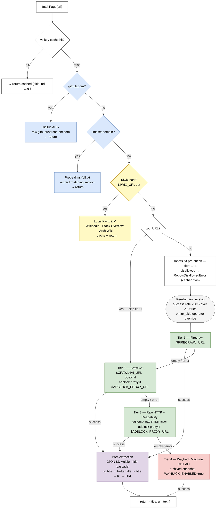

# searxng-mcp

[](https://claude.ai/code)
[](https://github.com/TadMSTR/searxng-mcp/actions/workflows/ci.yml)
[](https://opensource.org/licenses/MIT)
[](https://www.npmjs.com/package/@tadmstr/searxng-mcp)

An MCP server for private web search via a self-hosted [SearXNG](https://github.com/searxng/searxng) instance. Results are reranked by a local ML model, full-page content is fetched via Firecrawl, and an optional Ollama instance provides query expansion and LLM-synthesized summaries.

Designed for use with Claude Code and LibreChat agents that need web search without sending queries to a third-party search API.

Built with [Claude Code](https://claude.ai/code) using the multi-agent workflow from [homelab-agent](https://github.com/TadMSTR/homelab-agent) — the same platform that uses searxng-mcp in production for AI-assisted research.

## Quick Start

A running [SearXNG](https://github.com/searxng/searxng) instance is required. A cache backend is strongly recommended.

**Minimal stack** — start a Dragonfly/Valkey cache backend and run searxng-mcp:

```bash
docker compose -f docker-compose.example.yml up -d
SEARXNG_URL=http://localhost:8081 CACHE_URL=redis://localhost:6381 npx @tadmstr/searxng-mcp
```

For a full local topology including Firecrawl, Crawl4AI, Ollama, Kiwix, the adblock proxy, and NATS, see [`docker-compose.full.yml`](docker-compose.full.yml).

## Tools

| Tool | Description | Key Parameters |
|------|-------------|----------------|
| `search` | Search via SearXNG with local reranking. Fetches a wider result pool, reranks by relevance, returns top N. | `query`, `num_results` (1–20), `category`, `time_range`, `domain_profile`, `expand`, `language` |
| `search_and_fetch` | Search, rerank, then fetch full content of the top result(s) using the fetch cascade (Firecrawl → Crawl4AI → raw HTTP). | `query`, `category`, `time_range`, `fetch_count` (1–3), `domain_profile`, `expand`, `language` |
| `search_and_summarize` | Search, fetch top results, then synthesize a summary with citations via Ollama (`OLLAMA_SUMMARIZE_MODEL`). Falls back to raw fetched content if Ollama is unavailable. | `query`, `fetch_count` (1–5), `category`, `time_range`, `domain_profile`, `expand`, `language` |
| `fetch_url` | Fetch and extract readable markdown from any public URL. GitHub URLs use the GitHub API; all others use the fetch cascade (Firecrawl → Crawl4AI → raw HTTP). Truncated to 8,000 characters. | `url`, `domain_profile` |
| `crawl_site` | Crawl an entire site and return a manifest of URL/title/snippet for each page. Tries Firecrawl crawl first, falls back to sitemap parsing, then optional BFS. Full page content is cached in Valkey so follow-up `fetch_url` calls are zero-cost. | `url`, `max_pages` (default: `CRAWL_MAX_PAGES_DEFAULT`), `bfs` (bool, opt-in BFS) |
| `clear_cache` | Purge the search cache, fetch cache, crawl manifest cache, or all. Useful when researching fast-moving topics where cached results may be stale. | `target` (`search`, `fetch`, `crawl`, `all`) |

### Parameters

**`category`** — `general` (default), `news`, `it`, `science`

**`time_range`** — `day`, `week`, `month`, `year` — limits results by publication date. Omit for all-time results.

**`fetch_count`** — number of top reranked results to fetch full content for (default `1`, max `3` for `search_and_fetch`; default `3`, max `5` for `search_and_summarize`).

**`domain_profile`** — apply a named domain filter profile: `homelab` (surfaces self-hosted/Linux docs) or `dev` (surfaces Stack Overflow, MDN, npm). Omit for default filters.

**`expand`** — when `true`, rewrites the query via Ollama (`OLLAMA_EXPAND_MODEL`) before searching to improve recall. Requires `OLLAMA_URL`. Defaults to the `EXPAND_QUERIES` env var value.

**`language`** — BCP-47 language code (e.g. `en`, `de`) or `all` to restrict to a specific language. Omit to use the SearXNG instance default. Available on `search`, `search_and_fetch`, and `search_and_summarize`.

## Architecture

```
MCP client (stdio)
      │
      ▼
  searxng-mcp ──────────────→ cache ($CACHE_URL)           → result cache (search 1h, fetch 24h, crawl 6h)
      │
      ├── expand (optional) →  Ollama ($OLLAMA_URL)        → rewritten query (qwen3:4b)
      ├── search ───────────→ SearXNG ($SEARXNG_URL)      → raw results
      ├── rerank ───────────→ Reranker ($RERANKER_URL)    → ranked results
      │                       (fallback: SearXNG order if reranker unavailable)
      ├── fetch content ────┬→ GitHub API (github.com)    → markdown
      │                     ├→ Kiwix ($KIWIX_URL)         → ZIM content (Wikipedia/SO/Arch Wiki, fast path)
      │                     ├→ Hister ($HISTER_URL)       → browsing-history index (login-walled/JS-heavy fast path)
      │                     ├→ Firecrawl ($FIRECRAWL_URL) → page markdown (tier 1)
      │                     ├→ Crawl4AI ($CRAWL4AI_URL)  → page markdown (tier 2, optional; via $ADBLOCK_PROXY_URL if set)
      │                     ├→ Raw HTTP + Readability     → page markdown (tier 3 fallback; via $ADBLOCK_PROXY_URL if set)
      │                     └→ Wayback Machine (opt-in)  → archived page markdown (tier 4, $WAYBACK_ENABLED)
      ├── crawl_site ───────┬→ Firecrawl crawl           → page manifest (phase 1)
      │                     ├→ Sitemap parsing           → page manifest (phase 2 fallback, fast-xml-parser)
      │                     └→ BFS crawl (opt-in)        → page manifest (phase 3, $CRAWL_BFS_ENABLED)
      └── summarize (opt.) →  Ollama ($OLLAMA_URL)        → synthesized summary ($OLLAMA_SUMMARIZE_MODEL)
```



SearXNG and Firecrawl are required. Crawl4AI, Valkey, Ollama, Kiwix, and the reranker are optional — the server degrades gracefully when any of these are unavailable.

### Adblocking

searxng-mcp uses two independent adblocking sidecars, one per fetch tier group:

| Sidecar | Tier | Mechanism |
|---------|------|-----------|
| `docker/puppeteer-adblock/` | Tier 1 (Firecrawl) | CDP-level interception — full HTTPS filtering, same browser process |
| `docker/adblock-proxy/` | Tiers 2+3 (Crawl4AI, raw fetch) | HTTP forward proxy — filters plain-HTTP ad domains |

#### Tier 1 — Puppeteer adblock

The `firecrawl-puppeteer` service used by Firecrawl runs a custom image (`docker/puppeteer-adblock/`) that layers `@ghostery/adblocker-puppeteer` over the upstream `trieve/puppeteer-service-ts`. EasyList + EasyPrivacy are loaded at startup and refreshed every 168 hours; the blocker is applied to every page Firecrawl creates. Speeds up fetches of ad-heavy sites and shrinks rendered DOM size.

Env vars:

| Var | Default | Description |
|-----|---------|-------------|
| `ADBLOCK_DISABLE` | _unset_ | Set to `true` to skip filter loading entirely. |
| `ADBLOCK_FILTERS_URL` | EasyList + EasyPrivacy | Comma-separated list of filter list URLs. |
| `ADBLOCK_REFRESH_HOURS` | `168` | Cadence at which the blocker rebuilds from the configured URLs. |

The base image is pinned by SHA256 digest. To deploy a change, rebuild and restart the service:

```bash
docker compose -f ~/docker/firecrawl-simple/docker-compose.yml up -d --build firecrawl-puppeteer
```

**Per-domain bypass:** `domains.json` reserves an `adblock_skip` slot for future operator overrides. Wiring isn't implemented yet — it would require Firecrawl to forward a custom header through to the puppeteer-service, which isn't part of its current API. Tracked as scope-creep item I.

#### Tier 2+3 — Adblock proxy

Set `ADBLOCK_PROXY_URL` (e.g. `http://adblock-proxy:8118`) to route Crawl4AI and raw Node fetch requests through an HTTP forward proxy that filters ad and tracker requests. HTTPS CONNECT tunnels are passed through unmodified — no MITM, so filtering applies to plain-HTTP ad domains only. The tier-1 puppeteer hook already handles full HTTPS filtering for that tier; the proxy covers what leaks through at tiers 2 and 3.

See [`docker/adblock-proxy/`](docker/adblock-proxy/) for the service definition, configuration options, and deployment instructions (included in `docker-compose.full.yml`).

### Data-driven tier routing

Before invoking the fetch cascade, searxng-mcp reads the domain's `tier_stats_30d` (see [domain capability database](#domain-capability-database)) and skips any tier with success rate below 30% over at least 10 attempts. Cold-start domains (<10 attempts) keep the default cascade. Each skip emits a `searxng.fetch.tier.skipped` NATS event with `reason: low_success_rate` and increments `searxng_fetch_total{outcome=skipped}`.

**Operator override.** Add a `tier_skip` map to `domains.json` to force-skip tiers regardless of stats:

```json
{
  "tier_skip": {
    "example-bot-blocked.com": ["tier1"],
    "another-site.example": ["tier1", "tier2"]
  }
}
```

`tier_skip` keys can be bare domains (`example.com` matches the domain and all subdomains) or domain + path prefix (`example.com/api/`). The file is hot-reloaded — no restart needed. Manual overrides emit `reason: operator_override`.

### Domain capability database

Every fetch records what searxng-mcp learns about the target domain to Valkey under `domain:<hostname>` (90-day TTL, schema_version 2). Captured per record:

- `tier_stats_30d.{tier1,tier2,tier3}.{attempts, ok, fail, last_fail_reason, window_start_ms}` — fetch success rate per tier over a rolling 30-day window; counters reset when the window expires
- `capabilities.robots_txt.{present, fetched, allows_us}` — robots.txt presence and whether it permits us
- `capabilities.llms_full_txt.{present, size_bytes, last_checked}` — whether the domain serves `/llms-full.txt`
- `capabilities.json_ld_article.{sampled, present, last_sampled_at}` — how often Article-schema JSON-LD is found
- `capabilities.og_title.{sampled, present, last_sampled_at}` — same for `<meta property="og:title">`
- `preferred_strategy` — currently set to `llms_full_txt` when a present probe lands; future phases will use this to skip the tier cascade

Inspect a record with the bundled CLI:

```bash
pnpm dump-domain docs.anthropic.com
```

Concurrent updates for the same hostname (the tier-attempt, robots-probe, and post-extract-sample recorders that fire in parallel during one fetch) are serialized through an in-process write queue per hostname.

### llms.txt fast path

For whitelisted documentation domains in `domains.json` (`llms_txt` array), `fetchPage` tries `<origin>/llms-full.txt` first and extracts the section matching the requested URL before invoking any tier. This avoids running puppeteer against well-instrumented docs sites and returns a clean markdown section directly. Probe outcomes and the full body are cached in Valkey (`llms:<origin>:full`, 24 h / 7 d for present/absent). Default whitelist: `docs.anthropic.com`, `docs.openai.com`, `docs.stripe.com`, `docs.crawl4ai.com`, `docs.firecrawl.dev`, `docs.cursor.com`. Extend by editing `domains.json` — the file is hot-reloaded.

### Kiwix fast path

When `KIWIX_URL` is set, fetch requests for known offline-capable hosts are intercepted
before the Firecrawl/Crawl4AI cascade and served from the local [Kiwix](https://kiwix.org/)
ZIM archive. This eliminates the 100% tier-1 failure rate for sites like Wikipedia (which
blocks headless scrapers) and returns clean readable content with zero external network traffic.

Supported hosts and ZIM books (kiwix-serve must run with `--nodatealiases` / `-z`):

| Host | ZIM book |
|------|----------|
| `en.wikipedia.org`, `wikipedia.org` | `wikipedia_en_all_mini` |
| `stackoverflow.com` | `stackoverflow.com_en_all` |
| `wiki.archlinux.org` | `archlinux_en_all_maxi` |

The Kiwix path runs after the llms-txt fast path and before the robots gate. If the Kiwix
request fails or returns empty, the full tier cascade runs as normal. When `KIWIX_URL` is
unset the feature adds zero overhead — `isKiwixHost()` returns false immediately.

Set `KIWIX_URL` to your kiwix-serve base URL (e.g. `http://localhost:8292`).

### Site crawling

`crawl_site` crawls an entire site and returns a manifest of URL/title/snippet for each page found. It uses a three-phase strategy cascade:

1. **Firecrawl crawl** — sends a crawl job to Firecrawl (`/crawl` endpoint), polls until complete, and returns the full page list. Controlled by `FIRECRAWL_CRAWL_POLL_INTERVAL_MS` and `FIRECRAWL_CRAWL_MAX_WAIT_MS`.
2. **Sitemap parsing** — if Firecrawl fails or returns empty, fetches `/sitemap.xml` (and linked sitemaps) and extracts URLs with titles/snippets. Uses `fast-xml-parser` for sitemap XML parsing.
3. **BFS crawl** (opt-in) — if sitemap parsing also fails, performs a breadth-first crawl starting from the given URL up to `CRAWL_BFS_MAX_DEPTH` link hops. Only runs when `CRAWL_BFS_ENABLED=true` or the `bfs` tool parameter is `true`.

Full page content fetched during the crawl is cached in Valkey (TTL: `CRAWL_MANIFEST_TTL_SECONDS`, default 6 hours). Subsequent `fetch_url` calls for any URL in the manifest return immediately from cache — zero fetch overhead for follow-up reads.

The manifest cache can be cleared with `clear_cache(target="crawl")`.

### Wayback Machine fallback

When `WAYBACK_ENABLED=true`, a fourth tier queries the Wayback Machine CDX API for an archived snapshot when all three main tiers fail. Returned content is prefixed with a provenance header (`[Archived snapshot – <timestamp> – <original_url>]`) so callers know the content may not reflect the current page state.

### Fetch quality

After any tier returns content with raw HTML, a post-extraction pass improves title and body quality:

- **JSON-LD Article extraction** — Schema.org `Article` / `NewsArticle` / `BlogPosting` / `TechArticle` blocks supply cleaner `headline` and `articleBody` than tier-1 chrome scraping (size-capped at 1 MB per script tag).
- **Title cascade** — falls back through `og:title` → `twitter:title` → `<title>` (with publisher-suffix stripping) → first `<h1>` → URL.
- **Tier-2 Readability comparison** — when Crawl4AI returns markdown, JSDOM+Readability also runs over its raw HTML and is preferred when its text is longer (or unconditionally when Crawl4AI returns less than 500 chars).

### Observability (opt-in)

Tracing, metrics, and event publishing are entirely opt-in — with none of the env vars below set, the server has zero observability overhead and never loads the OpenTelemetry or NATS packages at runtime.

**OpenTelemetry (traces + metrics)** — set `OTEL_EXPORTER_OTLP_ENDPOINT` to your collector's HTTP endpoint and the server emits:

- Spans (per request): `tool.<name>` → `expand_query`? → `searxng_request` → `rerank` → `fetch` (×N) → `tier1_firecrawl` | `tier2_crawl4ai` | `tier3_rawfetch` → `post_extract`; plus `summarize_llm` for `search_and_summarize`.
- Counters: `searxng_search_total{profile, expand}`, `searxng_fetch_total{tier, outcome}`, `searxng_cache_total{namespace, outcome}`, `searxng_errors_total{stage, error_type}`.
- Histograms: `searxng_search_duration_seconds{profile}`, `searxng_fetch_duration_seconds{tier, outcome}`.

Standard OTEL env vars apply (`OTEL_SERVICE_NAME` defaults to `searxng-mcp`).

**NATS events** — set `NATS_URL` (e.g. `nats://localhost:4222`) and the server publishes a structured event on every search, fetch, cache hit/miss, robots skip, and error. Subjects:

| Subject | When |
|---------|------|
| `searxng.search.requested` | Search tool invoked |
| `searxng.search.completed` | Search returned (with sources, latency, rerank applied) |
| `searxng.fetch.requested` | `fetchPage` called |
| `searxng.fetch.tier.miss` | A tier returned empty or threw |
| `searxng.fetch.tier.skipped` | robots.txt disallowed |
| `searxng.fetch.completed` | Fetch resolved (with `tier_served`, `text_len`, latency) |
| `searxng.cache.hit` / `.miss` | On every Valkey lookup |
| `searxng.error` | Stage-tagged errors |

Each envelope includes `request_id` and (when OTel is enabled) `trace_id` so subscribers can join the two streams. Subject prefix overridable via `NATS_SUBJECT_PREFIX`. Search queries flow through `search.*` events — downstream consumers are responsible for any PII scrubbing.

### Politeness

- **Honest User-Agent** — outbound requests identify as `searxng-mcp/<version> (+https://github.com/TadMSTR/searxng-mcp; personal research)`.
- **robots.txt compliance** — `/robots.txt` is fetched once per origin and cached for 24 hours in Valkey under `robots:<origin>`. Disallowed paths are skipped before any tier runs and logged as `skipped_robots url=… reason=…`.

## Transport

**stdio** (default) — compatible with Claude Code MCP plugin and LibreChat `stdio` config.

**HTTP** — set `SEARXNG_MCP_TRANSPORT=http` to run as a shared HTTP/SSE server suitable for multi-client deployments or Docker-based setups. Binds to `SEARXNG_MCP_HOST:SEARXNG_MCP_PORT` (default `127.0.0.1:3001`):

```bash
SEARXNG_MCP_TRANSPORT=http SEARXNG_MCP_PORT=3001 npx @tadmstr/searxng-mcp
```

Register with Claude Code against an HTTP server:

```bash
claude mcp add-json searxng --scope user '{
  "type": "http",
  "url": "http://localhost:3001/mcp"
}'
```

## Prerequisites

- Node.js 20+
- pnpm (or npm)
- A running [SearXNG](https://github.com/searxng/searxng) instance
- A running [Firecrawl](https://github.com/mendableai/firecrawl) instance
- A running reranker exposing a Jina-compatible `/v1/rerank` endpoint (optional)
- A running [Valkey](https://valkey.io/) or Redis-compatible instance (optional, for result caching)
- A running [Ollama](https://ollama.com/) instance with `qwen3:4b` and/or `qwen3:14b` pulled (optional, for query expansion and summarization)

### SearXNG

SearXNG must have JSON output format enabled. In `settings.yml`:

```yaml
search:
  formats:
    - html
    - json
```

### Reranker

The reranker must expose a Jina-compatible `/v1/rerank` endpoint. A lightweight FlashRank wrapper works well — see the [`docker/reranker/`](https://github.com/TadMSTR/homelab-agent/tree/main/docker/reranker) reference in [homelab-agent](https://github.com/TadMSTR/homelab-agent).

### Firecrawl

Any Firecrawl-compatible instance works. The local [firecrawl-simple](https://github.com/mendableai/firecrawl/tree/main/apps/api) deployment is sufficient. Set `FIRECRAWL_API_KEY` if your instance requires authentication (defaults to `placeholder-local` for local deployments that skip auth).

### Crawl4AI

[Crawl4AI](https://github.com/unclecode/crawl4ai) is an optional second-tier fetch fallback used when Firecrawl returns empty content (bot-blocked pages, JS-heavy sites). Set `CRAWL4AI_URL` to enable it. If unset, the cascade skips to raw HTTP fetch.

```bash
docker run -d -p 11235:11235 unclecode/crawl4ai:0.8.6
```

If your instance requires API token authentication, set `CRAWL4AI_API_TOKEN`.

On the `search_and_summarize` path, Crawl4AI requests use `fit_markdown` for noise-filtered content extraction. Other callers (`search_and_fetch`, `fetch_url`) use `raw_markdown`.

### Kiwix (optional)

[kiwix-serve](https://github.com/kiwix/kiwix-tools) serves ZIM archives over HTTP. Download
the required ZIM files and run kiwix-serve with `--nodatealiases` (`-z`) so book names are
stable:

```bash
kiwix-serve --port 8292 --nodatealiases /path/to/zims/
```

Required ZIM files for each supported host:
- Wikipedia: `wikipedia_en_all_mini` (or `maxi`)
- Stack Overflow: `stackoverflow.com_en_all`
- Arch Wiki: `archlinux_en_all_maxi`

ZIM files can be downloaded from [library.kiwix.org](https://library.kiwix.org/).

### Hister (optional)

[Hister](https://github.com/nicholasgasior/hister) is a browsing-history index populated by a Firefox extension. When `HISTER_URL` is set, `fetchPage` checks the history index before invoking the tier cascade — useful for login-walled and JS-heavy pages where scrapers fail.

Set `HISTER_URL` to your Hister instance base URL and `HISTER_TOKEN` if bearer token auth is required.

### Valkey / Redis

Any Redis-compatible instance. Valkey is recommended. Search results are cached for 1 hour; fetched pages for 24 hours. If unavailable, the server operates without caching.

### Ollama

Required for `expand` and `search_and_summarize`. Pull the required models:

```bash
ollama pull qwen3:4b   # query expansion
ollama pull qwen3:14b  # summarization
```

Set `think: false` behavior is handled automatically — no extra Ollama configuration needed.

## Configuration

All service URLs are configurable via environment variables.

| Variable | Default | Description |
|----------|---------|-------------|
| `SEARXNG_URL` | `http://localhost:8081` | SearXNG instance URL |
| `FIRECRAWL_URL` | `http://localhost:3002` | Firecrawl instance URL |
| `RERANKER_URL` | `http://localhost:8787` | Reranker instance URL |
| `FIRECRAWL_API_KEY` | `placeholder-local` | Firecrawl API key (if required) |
| `GITHUB_TOKEN` | *(unset)* | GitHub personal access token — increases rate limit from 60 to 5,000 req/hour |
| `OLLAMA_URL` | *(unset)* | Ollama API base URL — required for `expand` and `search_and_summarize` |
| `OLLAMA_API_KEY` | *(unset)* | Bearer token for authenticated Ollama proxies — adds `Authorization: Bearer <key>` header when set |
| `OLLAMA_EXPAND_MODEL` | `qwen3:4b` | Model used by query expansion (`expand` parameter). Override without rebuilding. |
| `OLLAMA_SUMMARIZE_MODEL` | `qwen3:14b` | Model used by `search_and_summarize`. Override without rebuilding. |
| `CACHE_URL` | `redis://localhost:6381` | Redis-compatible URL — enables result caching. Also accepts `VALKEY_URL` or `REDIS_URL` as aliases. Works with Redis, Valkey, and Dragonfly. Server degrades gracefully if unavailable. |
| `CACHE_TTL_SECONDS` | `3600` | Search result cache TTL in seconds |
| `FETCH_CACHE_TTL_SECONDS` | `86400` | Fetched page cache TTL in seconds |
| `CRAWL_MANIFEST_TTL_SECONDS` | `21600` | Crawl manifest and page content cache TTL in seconds (6 hours) |
| `CRAWL_MAX_PAGES_DEFAULT` | `20` | Default max pages returned by `crawl_site` when no `max_pages` is passed |
| `CRAWL_BFS_ENABLED` | `false` | Set to `true` to enable BFS fallback in `crawl_site` globally. Can also be enabled per-call with the `bfs` parameter. |
| `CRAWL_BFS_MAX_DEPTH` | `3` | Maximum link-hop depth for BFS crawl |
| `FIRECRAWL_CRAWL_POLL_INTERVAL_MS` | `2000` | Polling interval when waiting for a Firecrawl crawl job to complete |
| `FIRECRAWL_CRAWL_MAX_WAIT_MS` | `120000` | Maximum time to wait for a Firecrawl crawl job before falling back to sitemap |
| `EXPAND_QUERIES` | `false` | Set to `true` to enable query expansion globally |
| `CRAWL4AI_URL` | *(unset)* | Crawl4AI instance URL — enables second-tier fetch fallback when Firecrawl fails |
| `CRAWL4AI_API_TOKEN` | *(unset)* | Optional Bearer token for Crawl4AI instances with API token protection |
| `WAYBACK_ENABLED` | `false` | Set to `true` to enable Wayback Machine tier-4 fallback — fetches archived snapshots when all three tiers fail |
| `ADBLOCK_PROXY_URL` | *(unset)* | HTTP proxy URL for tier-2 (Crawl4AI) and tier-3 (raw Node fetch) adblocking — e.g. `http://adblock-proxy:8118`. See `docker/adblock-proxy/`. |
| `KIWIX_URL` | *(unset)* | kiwix-serve base URL (e.g. `http://localhost:8292`) — enables Kiwix fast path for Wikipedia, Stack Overflow, and Arch Wiki. Feature is disabled and zero-overhead when unset. |
| `HISTER_URL` | *(unset)* | Hister browsing-history index base URL — enables Hister fast path before the tier cascade for login-walled and JS-heavy pages. Feature disabled and zero-overhead when unset. |
| `HISTER_TOKEN` | *(unset)* | Bearer token for Hister API authentication. Required when `HISTER_URL` is set and the instance has token auth enabled. |
| `SEARXNG_MCP_TRANSPORT` | `stdio` | Transport mode: `stdio` (default, single-client) or `http` (shared HTTP/SSE server). |
| `SEARXNG_MCP_PORT` | `3001` | HTTP listen port (HTTP transport mode only). |
| `SEARXNG_MCP_HOST` | `127.0.0.1` | HTTP listen address (HTTP transport mode only). |

## Install

### npm (recommended)

```bash
npm install -g @tadmstr/searxng-mcp
```

Or run directly with `npx`:

```bash
npx @tadmstr/searxng-mcp
```

### From source

```bash
git clone https://github.com/TadMSTR/searxng-mcp.git
cd searxng-mcp
pnpm install
pnpm build
```

Output: `build/src/index.js`

## MCP Client Configuration

### Claude Code (CLI)

The recommended approach uses `claude mcp add-json` to register the server with full env var support:

```bash
claude mcp add-json searxng --scope user '{
  "command": "npx",
  "args": ["-y", "@tadmstr/searxng-mcp"],
  "env": {
    "SEARXNG_URL": "http://localhost:8081",
    "FIRECRAWL_URL": "http://localhost:3002",
    "RERANKER_URL": "http://localhost:8787",
    "OLLAMA_URL": "http://localhost:11434",
    "CACHE_URL": "redis://localhost:6379",
    "CACHE_TTL_SECONDS": "3600",
    "FETCH_CACHE_TTL_SECONDS": "86400",
    "EXPAND_QUERIES": "false",
    "CRAWL4AI_URL": "http://localhost:11235"
  }
}'
```

This writes to `~/.claude.json`. Do not add searxng to `~/.claude/settings.json` — that file is not used for MCP env var injection in Claude Code.

### Claude Desktop (`claude_desktop_config.json`)

```json
{
  "mcpServers": {
    "searxng": {
      "command": "npx",
      "args": ["-y", "@tadmstr/searxng-mcp"],
      "env": {
        "SEARXNG_URL": "http://localhost:8081",
        "FIRECRAWL_URL": "http://localhost:3002",
        "RERANKER_URL": "http://localhost:8787",
        "OLLAMA_URL": "http://localhost:11434",
        "CACHE_URL": "redis://localhost:6379",
        "CRAWL4AI_URL": "http://localhost:11235"
      }
    }
  }
}
```

### LibreChat (`librechat.yaml`)

```yaml
mcpServers:
  searxng:
    type: stdio
    command: node
    args:
      - /path/to/searxng-mcp/build/src/index.js
    env:
      SEARXNG_URL: http://localhost:8081
      FIRECRAWL_URL: http://localhost:3002
      RERANKER_URL: http://localhost:8787
      OLLAMA_URL: http://localhost:11434
      CACHE_URL: redis://localhost:6379
      CRAWL4AI_URL: http://localhost:11235
```

## GitHub URLs

`github.com` URLs are handled natively without Firecrawl:

- **Repo root** (`github.com/owner/repo`) — fetches the README via the GitHub API
- **File blob** (`github.com/owner/repo/blob/branch/path/to/file`) — fetches raw content from `raw.githubusercontent.com`

Unauthenticated requests are rate-limited to 60/hour. Set `GITHUB_TOKEN` to raise this to 5,000/hour.

## Security

### URL safety

The `fetch_url` and `search_and_fetch` tools enforce a URL allowlist — private/internal IP ranges (`10.x`, `192.168.x`, `172.16-31.x`, `localhost`, `127.x`), IPv6 private ranges (`::1`, `fc00::/7`, `fe80::/10`), and non-HTTP protocols are blocked. This prevents the server from being used as an SSRF proxy into your local network.

### Redirect protection

HTTP redirects in raw fetch requests are blocked to prevent SSRF bypass via redirect chains to internal addresses.

### Dependency auditing

CI runs `pnpm audit` on every push. The lockfile (`pnpm-lock.yaml`) is committed for reproducible, auditable builds.

### Credential handling

No credentials are stored or logged by the server. API keys (`FIRECRAWL_API_KEY`, `GITHUB_TOKEN`, `CRAWL4AI_API_TOKEN`) are read from environment variables and used only in outbound requests to their respective services.

### Input validation

Environment variables are validated at startup — `RERANK_RECENCY_WEIGHT` warns on NaN, negative, or >1.0 values. Numeric tool parameters use `z.coerce.number()` with range constraints.

## Contributing

See [CONTRIBUTING.md](CONTRIBUTING.md) for setup instructions, commit conventions, and the PR process.

## License

MIT
