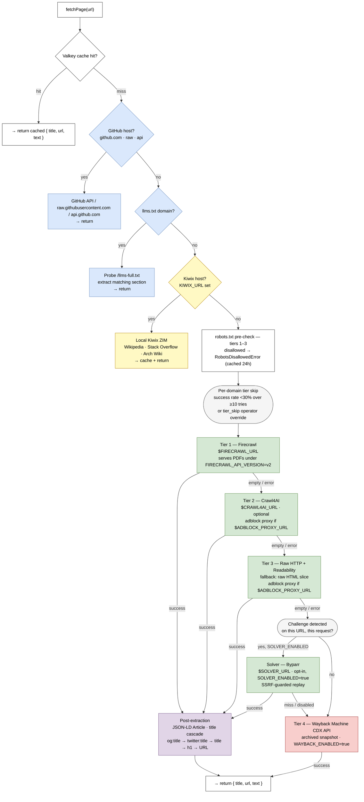

# searxng-mcp

[](https://claude.ai/code)
[](https://github.com/TadMSTR/searxng-mcp/actions/workflows/ci.yml)
[](https://opensource.org/licenses/MIT)
[](https://www.npmjs.com/package/@tadmstr/searxng-mcp)

An MCP server for private web search via a self-hosted [SearXNG](https://github.com/searxng/searxng) instance. SearXNG is the only requirement; everything else is optional and layers on top — a local ML model reranks results, a three-tier cascade (Firecrawl, Crawl4AI, in-process raw fetch) retrieves full-page content, and an Ollama instance provides query expansion and LLM-synthesized summaries.

Designed for use with Claude Code and LibreChat agents that need web search without sending queries to a third-party search API.

Built with [Claude Code](https://claude.ai/code) using the multi-agent workflow from [homelab-agent](https://github.com/TadMSTR/homelab-agent) — the same platform that uses searxng-mcp in production for AI-assisted research.

## Quick Start

**A running [SearXNG](https://github.com/searxng/searxng) instance is the only requirement.**
Everything else is optional and improves a specific dimension — see [Prerequisites](docs/configuration.md#prerequisites-and-service-setup).

**SearXNG only** — nothing else deployed:

```bash
SEARXNG_URL=http://localhost:8081 \
  FIRECRAWL_ENABLED=false \
  npx @tadmstr/searxng-mcp
```

What works in this configuration: `search` returns ranked results, and `fetch_url` /
`search_and_fetch` return extracted page content via tier 3 (raw HTTP fetch + Readability, wholly
in-process). What does not: semantic reranking (results keep SearXNG's ordering), query expansion
and `search_and_summarize` (no LLM), caching (every call is live), JS-heavy page rendering, and
offline serving. The startup capability line tells you which of these are off.

`FIRECRAWL_ENABLED=false` is what makes it a *clean* minimal run rather than merely a working one:
`FIRECRAWL_URL` defaults to `http://localhost:3002`, so without the switch every fetch first
attempts a connection to a Firecrawl that is not there, and books the failure into the domain
capability database.

**Recommended minimum** — add a cache backend, which is the single largest latency win:

```bash
docker compose -f docker-compose.example.yml up -d
SEARXNG_URL=http://localhost:8081 CACHE_URL=redis://localhost:6381 npx @tadmstr/searxng-mcp
```

For a full local topology including Firecrawl, Crawl4AI, Ollama, Kiwix, the adblock proxy, and NATS, see [`docker-compose.full.yml`](docker-compose.full.yml).

## Tools

| Tool | What it does |
|------|--------------|
| `search` | Search via SearXNG with local ML reranking, plus SearXNG's own direct answers, infoboxes and suggestions. |
| `search_and_fetch` | Search, rerank, then fetch full content of the top result(s) through the fetch cascade. |
| `search_and_summarize` | Search, fetch, then synthesize a cited summary via Ollama. Falls back to raw content if Ollama is absent. |
| `fetch_url` | Fetch and extract readable markdown from any public URL, via fast paths or the fetch cascade. |
| `crawl_site` | Crawl a site and return a URL/title/snippet manifest. Page content is cached, so follow-up `fetch_url` calls are free. |
| `clear_cache` | Purge the search, fetch or crawl cache. |
| `domain_stats` | Read-only view of the domain capability database — per-tier success rates, as structured output. |

Full parameter reference: [`docs/tools.md`](docs/tools.md).

## Why searxng-mcp?

There are a number of SearXNG MCP servers. Most wrap the search endpoint and stop there. The
differentiators here are in what happens *after* the search:

| | searxng-mcp | Typical SearXNG MCP server |
|---|---|---|
| SearXNG search | yes | yes |
| ML reranking of results | local cross-encoder, reorders by relevance | SearXNG's own ordering |
| Full-page content retrieval | three-tier cascade — Firecrawl, Crawl4AI, in-process raw fetch + Readability | none, or a single raw fetch |
| Per-domain routing | domain capability database learns which tier works per domain and skips the ones that do not | none |
| Summarisation | Ollama, with citations back to source URLs | none |
| Site crawling | `crawl_site` — Firecrawl crawl, sitemap fallback, optional BFS | none |
| Caching | persistent, shared across clients (Valkey/Redis) | in-process or none |
| Challenge handling | detection-gated solver tier, plus a Wayback fallback | none |
| Observability | OpenTelemetry traces and metrics, NATS events, structured logs | none |

**Only SearXNG is required.** Everything in the table above degrades gracefully: with nothing
else deployed, `fetch_url` still returns extracted content from the in-process tier 3, and the
startup capability line tells you exactly which features are off.

## Architecture

The fetch cascade, in full. Each stage is optional and skipped cleanly when unconfigured.


```mermaid
flowchart TD
    entry["fetchPage(url)"]
    cache{"Valkey cache hit?"}
    cached["→ return cached { title, url, text }"]
    github{"GitHub host?\ngithub.com · raw · api"}
    gh_fetch["GitHub API / raw.githubusercontent.com / api.github.com\n→ return"]
    llms{"llms.txt domain?"}
    llms_fetch["Probe /llms-full.txt\nextract matching section\n→ return"]
    kiwix{"Kiwix host?\nKIWIX_URL set"}
    kiwix_fetch["Local Kiwix ZIM\nWikipedia · Stack Overflow · Arch Wiki\n→ cache + return"]
    robots["robots.txt pre-check — tiers 1–3\ndisallowed → RobotsDisallowedError (cached 24h)"]
    tier_skip(["Per-domain tier skip\nsuccess rate &lt;30% over ≥10 tries\nor tier_skip operator override"])
    t1["Tier 1 — Firecrawl\n$FIRECRAWL_URL\nserves PDFs under FIRECRAWL_API_VERSION=v2"]
    t2["Tier 2 — Crawl4AI\n$CRAWL4AI_URL · optional\nadblock proxy if $ADBLOCK_PROXY_URL"]
    t3["Tier 3 — Raw HTTP + Readability\nfallback: raw HTML slice\nadblock proxy if $ADBLOCK_PROXY_URL"]
    challenge(["Challenge detected\non this URL, this request?"])
    solver["Solver — Byparr\n$SOLVER_URL · opt-in, SOLVER_ENABLED=true\nSSRF-guarded replay"]
    t4["Tier 4 — Wayback Machine CDX API\narchived snapshot · WAYBACK_ENABLED=true"]
    post["Post-extraction\nJSON-LD Article · title cascade\nog:title → twitter:title → title → h1 → URL"]
    result["→ return { title, url, text }"]

    entry --> cache
    cache -->|hit| cached
    cache -->|miss| github
    github -->|yes| gh_fetch
    github -->|no| llms
    llms -->|yes| llms_fetch
    llms -->|no| kiwix
    kiwix -->|yes| kiwix_fetch
    kiwix -->|no| robots
    robots --> tier_skip
    tier_skip --> t1
    t1 -->|success| post
    t1 -->|"empty / error"| t2
    t2 -->|success| post
    t2 -->|"empty / error"| t3
    t3 -->|success| post
    t3 -->|"empty / error"| challenge
    challenge -->|"yes, SOLVER_ENABLED"| solver
    challenge -->|no| t4
    solver -->|success| post
    solver -->|"miss / disabled"| t4
    t4 -->|success| result
    post --> result

    style entry fill:#ffffff,stroke:#333333,color:#000000
    style cache fill:#ffffff,stroke:#333333,color:#000000
    style cached fill:#ffffff,stroke:#333333,color:#000000
    style github fill:#dae8fc,stroke:#6c8ebf,color:#000000
    style gh_fetch fill:#dae8fc,stroke:#6c8ebf,color:#000000
    style llms fill:#dae8fc,stroke:#6c8ebf,color:#000000
    style llms_fetch fill:#dae8fc,stroke:#6c8ebf,color:#000000
    style kiwix fill:#fff9c4,stroke:#b8860b,color:#000000
    style kiwix_fetch fill:#fff9c4,stroke:#b8860b,color:#000000
    style robots fill:#ffffff,stroke:#333333,color:#000000
    style tier_skip fill:#f5f5f5,stroke:#666666,color:#000000
    style t1 fill:#d5e8d4,stroke:#5a8a4a,color:#000000
    style t2 fill:#d5e8d4,stroke:#5a8a4a,color:#000000
    style t3 fill:#d5e8d4,stroke:#5a8a4a,color:#000000
    style challenge fill:#f5f5f5,stroke:#666666,color:#000000
    style solver fill:#d5e8d4,stroke:#5a8a4a,color:#000000
    style t4 fill:#f8cecc,stroke:#a03030,color:#000000
    style post fill:#e1d5e7,stroke:#7a5a8a,color:#000000
    style result fill:#ffffff,stroke:#333333,color:#000000
```

Read the rest — tier semantics, the domain capability database, adblocking, every fast path,
resilience and observability — in [`docs/architecture.md`](docs/architecture.md).

## Documentation

| | |
|---|---|
| [Configuration](docs/configuration.md) | Every environment variable, and setup for each optional backing service. |
| [Tools](docs/tools.md) | Full per-tool parameter reference. |
| [Deployment](docs/deployment.md) | Install, transports, HTTP auth, and MCP client recipes. |
| [Architecture](docs/architecture.md) | Fetch cascade, tier semantics, domain capability database. |
| [Security](docs/security.md) | SSRF, redirects, transport exposure, bounded reads, credentials. |

Index: [`docs/index.md`](docs/index.md).

## Contributing

See [CONTRIBUTING.md](CONTRIBUTING.md) for setup instructions, commit conventions, and the PR process.

### Integration tests

A real-Valkey integration suite covering domain-DB concurrency is gated on `VALKEY_TEST_URL` and skipped entirely when it's unset, so a plain `pnpm test` still works with no Valkey present:

```bash
VALKEY_TEST_URL=redis://:<password>@<host>:<port>/<scratch-db> pnpm test
```

Use a **scratch database index** — the suite writes and deletes `domain:*` keys and refuses to run against index `0` or `1` as a safety guard.

## License

MIT
