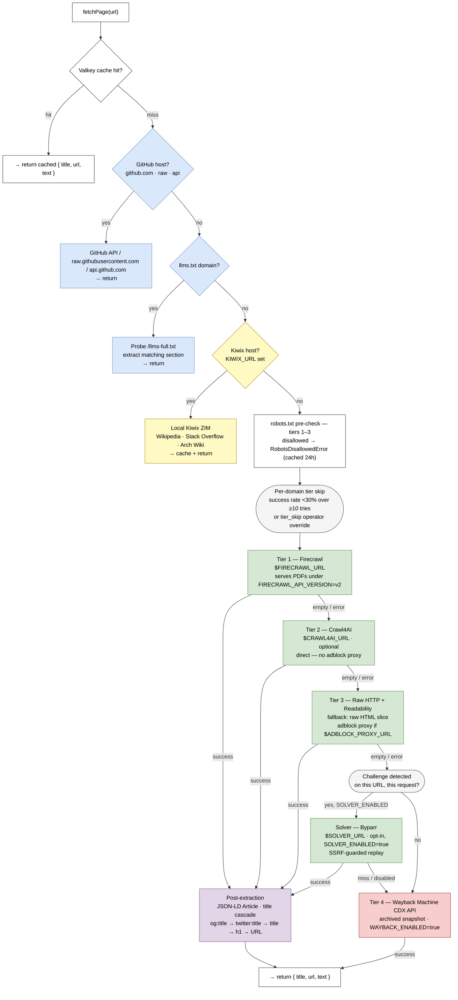

<!-- Split out of README.md in v3.24.0 (vikunja#683). The README had reached 905 lines / 70KB, at which point it was a reference manual pretending to be an introduction. -->

# Architecture

```
MCP client (stdio)
      │
      ▼
  searxng-mcp ──────────────→ cache ($CACHE_URL)           → result cache (search 1h, fetch 24h, crawl 6h)
      │
      ├── expand (optional) →  Ollama ($OLLAMA_URL)        → rewritten query (qwen3:4b)
      ├── search ───────────→ SearXNG ($SEARXNG_URL)      → raw results
      ├── rerank ───────────→ Reranker ($RERANKER_URL)    → ranked results
      │                       (fallback: SearXNG order if reranker unavailable)
      ├── fetch content ────┬→ GitHub API (github.com)    → markdown
      │                     ├→ Kiwix ($KIWIX_URL)         → ZIM content (Wikipedia/SO/Arch Wiki, fast path)
      │                     ├→ Hister ($HISTER_URL)       → browsing-history index (login-walled/JS-heavy fast path)
      │                     ├→ Firecrawl ($FIRECRAWL_URL) → page markdown (tier 1)
      │                     ├→ Crawl4AI ($CRAWL4AI_URL)  → page markdown (tier 2, optional; direct — no proxy, see below)
      │                     ├→ Raw HTTP + Readability     → page markdown (tier 3 fallback; via $ADBLOCK_PROXY_URL if set)
      │                     ├→ Byparr solver (opt-in)     → challenge-solved page markdown (only on a detected challenge, $SOLVER_ENABLED)
      │                     └→ Wayback Machine (opt-in)  → archived page markdown (tier 4, $WAYBACK_ENABLED)
      ├── crawl_site ───────┬→ Firecrawl crawl           → page manifest (phase 1)
      │                     ├→ Sitemap parsing           → page manifest (phase 2 fallback, fast-xml-parser)
      │                     └→ BFS crawl (opt-in)        → page manifest (phase 3, $CRAWL_BFS_ENABLED)
      └── summarize (opt.) →  Ollama ($OLLAMA_URL)        → synthesized summary ($OLLAMA_SUMMARIZE_MODEL)
```



**Only SearXNG is required.** Every tier below it is optional: Firecrawl, Crawl4AI, Valkey, Ollama, Kiwix, the reranker, the solver and Wayback each improve a named dimension, and the server degrades gracefully when any of them is unavailable. Tier 3 is a raw HTTP fetch plus Readability running in-process, so `fetch_url` still returns extracted content with nothing else deployed. Set `FIRECRAWL_ENABLED=false` and leave `CRAWL4AI_URL` unset to say so explicitly — those tiers are then skipped with `reason: not_configured` rather than attempted and missed.

## Adblocking

searxng-mcp ships two adblocking sidecars, but only one of them applies to every deployment:

| Sidecar | Tier | Mechanism | Applies when |
|---------|------|-----------|--------------|
| `docker/adblock-proxy/` | Tier 3 (raw fetch) only | HTTP forward proxy — filters plain-HTTP ad domains | `ADBLOCK_PROXY_URL` is set |
| `docker/puppeteer-adblock/` | Tier 1 (Firecrawl) | CDP-level interception in the browser service | **Only** on a `v1` firecrawl-simple stack built from `docker-compose.full.yml` |

### Tier 1 — Puppeteer adblock (v1 stacks only)

`docker/puppeteer-adblock/` builds an image layering `@ghostery/adblocker-puppeteer` over `trieve/puppeteer-service-ts`. EasyList + EasyPrivacy are loaded at startup and refreshed every 168 hours, and the blocker is applied to every page Firecrawl creates.

**It is not automatic, and it does not apply under `FIRECRAWL_API_VERSION=v2`:**

- It reaches a deployment only if that deployment builds it. `docker-compose.full.yml` in this repo does; a Firecrawl stack brought up from upstream's own compose, or any stack pointing `PLAYWRIGHT_MICROSERVICE_URL` at a stock `trieve/puppeteer-service-ts` image, does not — tier 1 then has no adblocking, silently.
- It is Puppeteer-specific. Upstream Firecrawl 2.x replaced the Puppeteer service with `apps/playwright-service-ts`, so on a `v2` backend this image is not part of the stack at all. Porting it would mean rewriting against `@ghostery/adblocker-playwright`, not rebuilding.

To check rather than assume, confirm the browser container carries the hook:

```bash
docker exec <firecrawl-browser-container> ls node_modules/@ghostery
```

Env vars, read by that image only:

| Var | Default | Description |
|-----|---------|-------------|
| `ADBLOCK_DISABLE` | _unset_ | Set to `true` to skip filter loading entirely. |
| `ADBLOCK_FILTERS_URL` | EasyList + EasyPrivacy | Comma-separated list of filter list URLs. |
| `ADBLOCK_REFRESH_HOURS` | `168` | Cadence at which the blocker rebuilds from the configured URLs. |

The base image is pinned by SHA256 digest. To rebuild and restart it:

```bash
docker compose -f docker-compose.full.yml up -d --build firecrawl-puppeteer
```

**Per-domain bypass:** `domains.json` reserves an `adblock_skip` slot for future operator overrides. Wiring isn't implemented — it would require Firecrawl to forward a custom header through to the browser service, which isn't part of its API. Tracked as scope-creep item I.

### Tier 3 — Adblock proxy

Set `ADBLOCK_PROXY_URL` (e.g. `http://adblock-proxy:8118`) to route raw Node fetch requests through an HTTP forward proxy that filters ad and tracker requests.

**This applies to tier 3 only. Tier 2 does not use it, and must not.** Tier 3 resolves the proxy hostname *in this process*; a proxy passed to Crawl4AI is resolved by *Crawl4AI*, inside its own container, which is a different network position entirely. Sending it was a 100% tier-2 outage until v3.25.0 — every crawl returned `net::ERR_PROXY_CONNECTION_FAILED` and was recorded as an ordinary empty result (vikunja#690). Crawl4AI 0.9.x additionally rejects the field at its trust boundary with HTTP 400. Adblocking for tier 2 would have to be configured server-side on Crawl4AI, which is a deployment change rather than a client one. HTTPS CONNECT tunnels are passed through unmodified — no MITM, so filtering applies to plain-HTTP ad domains only. Where the tier-1 hook above is in play it handles HTTPS filtering for that tier; where it is not — including every `v2` deployment — nothing filters tier 1 at all.

As of v3.19.0, the proxy validates the **resolved** address — not just the requested hostname string — on both its CONNECT and plain-HTTP paths before connecting, closing a DNS-rebinding gap (audit finding SSRF-10).

See [`docker/adblock-proxy/`](../docker/adblock-proxy/) for the service definition, configuration options, and deployment instructions (included in `docker-compose.full.yml`).

## Data-driven tier routing

Before invoking the fetch cascade, searxng-mcp reads the domain's `tier_stats_30d` (see [domain capability database](#domain-capability-database)) and skips any tier with success rate below 30% over at least 10 attempts. Cold-start domains (<10 attempts) keep the default cascade. Each skip emits a `searxng.fetch.tier.skipped` NATS event and increments `searxng_fetch_total{outcome=skipped}`, both carrying the reason. Three reasons exist: `low_success_rate` (the stats rule above), `operator_override` (a `tier_skip` entry in `domains.json`), and `not_configured` (the tier's service is switched off, or has no URL). `not_configured` takes precedence over both others — an override cannot un-skip a tier there is nothing to call. Because a skipped tier is never recorded as an attempt, an unconfigured tier no longer books misses into `tier_stats_30d` meaning “not deployed” rather than “tried and failed”.

**Operator override.** Add a `tier_skip` map to `domains.json` to force-skip tiers regardless of stats:

```json
{
  "tier_skip": {
    "example-bot-blocked.com": ["tier1"],
    "another-site.example": ["tier1", "tier2"]
  }
}
```

`tier_skip` keys can be bare domains (`example.com` matches the domain and all subdomains) or domain + path prefix (`example.com/api/`). The file is hot-reloaded — no restart needed. Manual overrides emit `reason: operator_override`.

## Content-type fast path

A URL serving structured, non-HTML content — `application/json`, any `*+json`, XML, YAML, TOML, CSV, or `text/plain` — is detected via a `HEAD` probe and routed straight to the raw-HTTP tier instead of the full Firecrawl/Crawl4AI cascade. JSON is returned pretty-printed inside a fenced code block. Previously, asking a headless browser to render a JSON API response or CDN asset returned empty markdown, so API and CDN endpoints (`registry.npmjs.org`, `api.osv.dev`, `cdn.jsdelivr.net`, …) simply failed.

Guarantees:
- The probe is **fail-open**. An unreachable host, a server that refuses `HEAD`, or an unreadable/unparseable `Content-Type` header all fall through to the normal cascade unchanged.
- `application/xhtml+xml` is deliberately excluded — that is markup for a browser, not structured data.
- HTML that a server mislabels as `text/plain` is still parsed as HTML, not dumped as a raw text block.

## Domain capability database

Every fetch records what searxng-mcp learns about the target domain to Valkey under `domain:<hostname>` (90-day TTL, schema_version 6). Captured per record:

- `tier_stats_30d.{tier1,tier2,tier3,tier4,solver,github}.{attempts, ok, fail, last_fail_reason, window_start_ms}` — fetch success rate per tier over a rolling 30-day window. The cutoff is applied at **read time**, shared by tier-routing decisions and `domain_stats` reporting, so the two cannot disagree — a domain fetched once and then left idle reports a genuinely empty window rather than stale numbers surviving until the next write. The `tier4` (Wayback Machine) slot is recorded only when `WAYBACK_ENABLED=true`; the `solver` slot (Byparr challenge-solving tier, see [Challenge detection and solver tier](#challenge-detection-and-solver-tier)) only when `SOLVER_ENABLED=true`. The `github` slot records the [GitHub fast path](tools.md#github-urls) (`raw.githubusercontent.com` / `api.github.com` / `github.com` README fetches), which bypasses the tier cascade but is still tracked here. A `schema_version` bump rebuilds existing records fresh — accumulated windows for currently-idle domains are discarded (precedented across the 1→2, 2→3, 3→4, 4→5, 5→6 bumps).
- `capabilities.metadata_fetch.{attempts, ok, fail, last_fail_reason}` — success/failure of the metadata side-channel fetch (`fetchRawHtmlForMetadata`, used for JSON-LD/og:title sampling). Tracked separately from `tier_stats_30d` since it answers "is this domain reachable at all", not "did full-content delivery succeed".
- `capabilities.seen_in_search.{count, last_seen_ms}` — how often the domain appears in `search` results. Written fire-and-forget by `searxSearch()` on every return path (including cache hits) with no fetch performed, so a domain can be tracked before it is ever fetched.
- `capabilities.robots_txt.{present, fetched, allows_us}` — robots.txt presence and whether it permits us
- `capabilities.llms_full_txt.{present, size_bytes, last_checked}` — whether the domain serves `/llms-full.txt`
- `capabilities.json_ld_article.{sampled, present, last_sampled_at}` — whether the page carries Article-schema JSON-LD at all (Schema.org `Article`/`NewsArticle`/`BlogPosting`/`TechArticle` and subtypes like `ScholarlyArticle`/`OpinionNewsArticle`/`LiveBlogPosting`, matched by bare name or fully-qualified `https://schema.org/...` `@type`), independent of whether that schema had extractable body text — many sites publish headline/metadata JSON-LD with no `articleBody`, which is a distinct concern from [post-extraction](#fetch-quality) actually using it.
- `capabilities.og_title.{sampled, present, last_sampled_at}` — same for `<meta property="og:title">`
- `preferred_strategy` — currently set to `llms_full_txt` when a present probe lands; future phases will use this to skip the tier cascade

Inspect a record with the bundled CLI, or query it from an agent via the `domain_stats` tool (single-domain or aggregate; see [Tools](tools.md)):

```bash
pnpm dump-domain docs.anthropic.com
```

`dump-domain` distinguishes a window that has expired from a tier that has no data at all, rather than showing both the same way.

Concurrent updates for the same hostname (the tier-attempt, robots-probe, and post-extract-sample recorders that fire in parallel during one fetch) are serialized through a server-side Lua compare-and-set, paired with an in-process per-key queue that removes contention between a single process's own writers so the CAS only has to arbitrate genuinely concurrent writes across processes. Versions before v3.17.0 used a `WATCH`/`MULTI`/`EXEC` read-modify-write against a shared connection, which does not actually serialize concurrent writers — data collected before v3.17.0 was substantially incomplete as a result. Upgrading discards existing tier statistics via the schema bump; expect `domain_stats` to read near-empty immediately after upgrading and refill over the following days.

### Domain-db persistence

The domain-db lives only in Valkey under a 90-day TTL and 30-day rolling windows, so a cache flush or TTL expiry erases capability learning that is expensive to re-acquire. Two CLIs make it durable:

```bash
pnpm domain-db-maintenance   # SCAN all domain:* records → write a dated JSON snapshot (+ prune) and emit OTel gauges
pnpm restore-domain-db       # re-seed the domain-db from the newest snapshot after a flush
```

- **`domain-db-maintenance`** is a standalone job — run it on a schedule via cron or a container cron sidecar, **not** as an in-process timer. (The original reason was that searxng-mcp ran as several concurrent per-agent stdio children that would each fire the timer. That is no longer true: since vikunja#149/#321 it is one shared container. The conclusion still holds for a different reason — an in-process timer ties a bounded full-keyspace `SCAN` to the lifetime of the request-serving process, whereas a standalone job can be scheduled, retried and observed on its own.) One bounded `SCAN` feeds both outputs: a durable dated snapshot and, when `OTEL_EXPORTER_OTLP_ENDPOINT` is set, gauges (`searxng_domains_tracked`, `searxng_domains_failing`, `searxng_domain_tier_success_ratio{tier}`) force-flushed before exit.
- **`restore-domain-db`** re-seeds only keys that are missing or whose live record is strictly staler than the snapshot (compares `last_fetch`) — it never clobbers a fresher-or-equal live record, so it is safe to run against a live, partially-populated Valkey (e.g. in a service boot sequence for automatic flush recovery).

| Env var | Default | Purpose |
|---------|---------|---------|
| `DOMAIN_DB_SNAPSHOT_DIR` | `./domain-db-snapshots` | Where dated snapshots are written/read. Set to a durable path (appdata or NFS mount) in deployment. |
| `DOMAIN_DB_SNAPSHOT_RETENTION` | `14` | How many snapshots to keep; older ones are pruned each maintenance run. |

## llms.txt fast path

For whitelisted documentation domains in `domains.json` (`llms_txt` array), `fetchPage` tries `<origin>/llms-full.txt` first and extracts the section matching the requested URL before invoking any tier. This avoids running puppeteer against well-instrumented docs sites and returns a clean markdown section directly. Probe outcomes and the full body are cached in Valkey (`llms:<origin>:full`, 24 h / 7 d for present/absent). Default whitelist: `docs.anthropic.com`, `docs.openai.com`, `docs.stripe.com`, `docs.crawl4ai.com`, `docs.firecrawl.dev`, `docs.cursor.com`. Extend by editing `domains.json` — the file is hot-reloaded.

A document is accepted only if it is between 1 KB and 64 MB; anything outside that is treated as absent and falls through to the normal tier cascade. The upper bound is a capability boundary as much as a memory one — for reference, `docs.anthropic.com/llms-full.txt` was 40.3 MB as of 2026-09-03, so lowering it much further would drop that domain off the fast path.

## Kiwix fast path

When `KIWIX_URL` is set, fetch requests for known offline-capable hosts are intercepted
before the Firecrawl/Crawl4AI cascade and served from the local [Kiwix](https://kiwix.org/)
ZIM archive. This eliminates the 100% tier-1 failure rate for sites like Wikipedia (which
blocks headless scrapers) and returns clean readable content with zero external network traffic.

Supported hosts and ZIM books (kiwix-serve must run with `--nodatealiases` / `-z`):

| Host | ZIM book |
|------|----------|
| `en.wikipedia.org`, `wikipedia.org` | `wikipedia_en_all_mini` |
| `stackoverflow.com` | `stackoverflow.com_en_all` |
| `wiki.archlinux.org` | `archlinux_en_all_maxi` |

The Kiwix path runs after the llms-txt fast path and before the robots gate. If the Kiwix
request fails or returns empty, the full tier cascade runs as normal. When `KIWIX_URL` is
unset the feature adds zero overhead — `isKiwixHost()` returns false immediately.

Set `KIWIX_URL` to your kiwix-serve base URL (e.g. `http://localhost:8292`).

## YouTube & Reddit fast paths

`fetch_url` recognises YouTube video URLs (`youtube.com`, `youtu.be`) and Reddit thread URLs and can serve them directly instead of scraping the rendered page:

- **YouTube** — extracts the video's caption track from the watch page and returns the transcript. Enabled by `YOUTUBE_TRANSCRIPT_ENABLED` (default on).
- **Reddit** — fetches the public `.json` view and returns the post plus top comments in the standard `{title, url, text}` shape; falls through on HTTP 429. Enabled by `REDDIT_FASTPATH_ENABLED` (default on).

Both rely on **unofficial, undocumented endpoints** (YouTube's timedtext API, Reddit's `.json`) — best-effort with no SLA; either may break on an upstream change, hence the kill switches. On any miss the request falls through to the normal tier cascade (which can still get a YouTube page's title/description).

**robots.txt:** both endpoints are disallowed by the sites' `robots.txt` (Reddit disallows everything; YouTube disallows `/api/`, where the transcript lives). By default these fast paths respect that and stay dormant, falling through to the cascade. On your own instance you can opt into direct fetching with `YOUTUBE_IGNORE_ROBOTS=true` / `REDDIT_IGNORE_ROBOTS=true`.

## Site crawling

`crawl_site` crawls an entire site and returns a manifest of URL/title/snippet for each page found. It uses a four-phase strategy cascade:

1. **Firecrawl crawl** — sends a crawl job to Firecrawl (`/crawl`), polls until complete, and returns the full page list. Targets `/v1/crawl` or `/v2/crawl` per `FIRECRAWL_API_VERSION`. Controlled by `FIRECRAWL_CRAWL_POLL_INTERVAL_MS` and `FIRECRAWL_CRAWL_MAX_WAIT_MS`.
2. **Firecrawl map** (`v2` only) — asks `/v2/map` for the site's URLs, then fetches them. Purpose-built for exactly what phase 3 hand-rolls, and it copes with sites whose sitemap is absent, stale or split across nested indexes. Skipped entirely under `v1`, where the endpoint does not exist.
3. **Sitemap parsing** — fetches `/sitemap.xml` (and linked sitemaps) and extracts URLs with titles/snippets. Uses `fast-xml-parser` for sitemap XML parsing.
4. **BFS crawl** (opt-in) — if sitemap parsing also fails, performs a breadth-first crawl starting from the given URL up to `CRAWL_BFS_MAX_DEPTH` link hops. Only runs when `CRAWL_BFS_ENABLED=true` or the `bfs` tool parameter is `true`.

Each phase falls through to the next, but **no longer silently**: a non-2xx from the crawl
start, the crawl poll or the map endpoint is logged and recorded against the `crawl` slot in
the per-domain stats, so `domain_stats` answers "does the Firecrawl phase ever succeed here?"
without needing a live probe.

Full page content fetched during the crawl is cached in Valkey (TTL: `CRAWL_MANIFEST_TTL_SECONDS`, default 6 hours). Subsequent `fetch_url` calls for any URL in the manifest return immediately from cache — zero fetch overhead for follow-up reads.

The manifest cache can be cleared with `clear_cache(target="crawl")`.

## Wayback Machine fallback

When `WAYBACK_ENABLED=true`, a fourth tier queries the Wayback Machine CDX API for an archived snapshot when all three main tiers fail. Returned content is prefixed with a provenance header (`[Archived snapshot – <timestamp> – <original_url>]`) so callers know the content may not reflect the current page state.

## Challenge detection and solver tier

A Cloudflare-style challenge interstitial is frequently served with **HTTP 200** — routine for
Managed Challenge and Turnstile — which used to pass straight through the tier cascade as a
successful fetch: Readability-extracted, cached, and written to the domain capability database
as evidence the tier works on that domain, feeding tier-skip decisions on nothing but a wrong
signal. As of v3.19.0, tiers 1–3 detect this case (matched on Cloudflare edge headers at
403/503, and on interstitial markers in a 200-status body) and report it as a distinct miss
(`reason: challenge_detected`) instead of a hit. A detected challenge is never cached and never
written to domain-db.

When `SOLVER_ENABLED=true` and `SOLVER_URL` points at a running solver — Byparr, or any service
implementing FlareSolverr's `POST /v1` contract — a challenge detected on a given request
triggers one solve attempt, dispatched after the tier 3 cascade fails and before the Wayback
fallback. The solve is **strictly per-request**: the tier never fires on a URL that was not
challenged in that same request, so it adds no overhead to the ordinary path. The solver's
response is replayed through the normal bounded-fetch and extraction path — re-validated for
SSRF (`assertPublicUrl` + `assertResolvedPublic` against the solver's resulting URL, since it
may differ from the one requested) and re-checked for a challenge — rather than trusted
directly, so a "solved" page that is still an interstitial registers as a miss, not a cache
write. Solver-returned cookies are scoped to the solved host and never forwarded elsewhere.

**This is not a guaranteed bypass.** Byparr's own documentation is explicit that a solve is not
guaranteed and often needs residential-IP traffic. A miss here is the expected common case and
degrades cleanly into the Wayback tier — not an error, and not something to alert on.

## Fetch quality

After any tier returns content with raw HTML, a post-extraction pass improves title and body quality:

- **JSON-LD Article extraction** — Schema.org `Article` / `NewsArticle` / `BlogPosting` / `TechArticle` blocks supply cleaner `headline` and `articleBody` than tier-1 chrome scraping (size-capped at 1 MB per script tag).
- **Title cascade** — falls back through `og:title` → `twitter:title` → `<title>` (with publisher-suffix stripping) → first `<h1>` → URL.
- **Tier-2 Readability comparison** — when Crawl4AI returns markdown, JSDOM+Readability also runs over its raw HTML and is preferred when its text is longer (or unconditionally when Crawl4AI returns less than 500 chars).

## Relevance filtering (`min_score`)

The three search tools accept `min_score` (0–1), a floor applied after reranking. Omit it and nothing changes.

It filters on the **raw cross-encoder `relevance_score`**, not on the value used for ordering. Ranking sorts by `relevance_score + RERANK_RECENCY_WEIGHT * recencyScore(publishedDate)`, which with the default weight of `0.15` ranges over **0–1.15, not 0–1**. Filtering a parameter called "minimum relevance" on that number would quietly make it mean "relevant enough *or* recent enough". Filtering happens before the top-N slice, so the floor never costs you a result that cleared it.

Two things make this knob behave differently from how a 0–1 range suggests. Both were measured against the local FlashRank service on the query *"how to configure nginx reverse proxy"*:

| Document | `relevance_score` |
|---|---|
| nginx reverse-proxy guide (`proxy_pass`) | **0.998** |
| Apache `mod_proxy` reverse proxying | **0.967** |
| nginx install page (topical, wrong subject) | **0.0028** |
| banana bread recipe | **0.0000151** |

- **The distribution is strongly bimodal.** Relevant results cluster near 1.0, irrelevant ones near 0, with very little in between — so any threshold in roughly 0.01–0.9 behaves near-identically. Useful values are around **0.01–0.1**; `0.5` is not a meaningful midpoint.
- **A high score means topically related, not correct.** The Apache document scored 0.967 on an nginx query. `min_score` is a topicality floor and cannot be trusted as a correctness filter.

Thresholds are model-dependent and not comparable across rerankers. When the reranker is unavailable there are no scores to filter on, so `min_score` becomes a **no-op with a throttled warning** — returning unfiltered results silently would let you believe a floor had been applied, and returning nothing would turn a reranker outage into "no results found".

## Resilience

- **Multi-instance SearXNG failover.** `SEARXNG_URL` accepts a list of interchangeable replicas (`,` or `;` separated), tried in order. A single value behaves exactly as before — one request, one host, no health lookup, no extra cache traffic. Three things about the multi-instance path are worth knowing:
  - The timeout budget is **total, not per instance**. `SEARXNG_TOTAL_TIMEOUT_MS` bounds the whole call and is decremented as candidates fail, so adding a replica cannot make a total outage take longer to report.
  - Health state lives in the **cache, not in process memory**, so one process's discovery of a dead instance informs the next call. It is a hint, not a circuit breaker: a failed instance is moved to the back of the order for `SEARXNG_UNHEALTHY_TTL_SECONDS`, never removed, and if every instance is marked down the full list is tried anyway. A cache outage degrades to "try every instance in configured order" — never to an error.
  - **Failover is loud.** Each fall-through emits a `search.failover` NATS event and a throttled stderr line. A silent failover is indistinguishable from a healthy primary, which is how a half-dead deployment goes unnoticed for weeks.

  Fan-out (querying replicas in parallel and merging) is deliberately **not** implemented: it needs meta reconciliation with no obvious right answer — if two instances return different `answers`/`infoboxes`, which wins? `searxSearch` already merges across expanded query variants, so the marginal recall gain is small.

- **Cache never hangs a search.** The Valkey client is bounded by `CACHE_COMMAND_TIMEOUT_MS`/`CACHE_CONNECT_TIMEOUT_MS`/`CACHE_MAX_RETRIES_PER_REQUEST` (see [Configuration](configuration.md)). A stalled or CPU-spiked cache backend now rejects the command instead of hanging forever — the existing fail-soft handling degrades that rejection to a cache miss (serve live) rather than throwing. Cache connect failures, client errors, and per-command errors emit a throttled `[searxng-mcp]` stderr line (deduped per key so a sustained outage leaves a periodic breadcrumb, not a flood) — stderr is always on, and is the sink that never depends on configuration. On the forge deployment OTel and NATS are also wired (`OTEL_EXPORTER_OTLP_ENDPOINT` and `NATS_URL` are both set, and the startup capability line reports `otel,nats` in its on-list), so stderr is the floor rather than the whole story.
- **Process crash handlers** — `uncaughtException` logs then exits 1, so the supervisor restarts cleanly (Docker's `restart: unless-stopped` on the forge deployment); `unhandledRejection` logs and continues rather than crashing the shared process silently.
- **Graceful-degradation warnings** — the reranker fallback and the Ollama/LLM expand + summarize fallbacks emit one throttled stderr line each when they silently degrade quality (reranker unavailable, LLM backend unreachable).
- **Version is single-sourced** from `package.json` at runtime (`src/version.ts`) — the `McpServer` version, OTel tracer/meter version, and outbound `USER_AGENT` all track it, so they can't drift independently.

## Observability (opt-in)

Tracing, metrics, and event publishing are entirely opt-in — with none of the env vars below set, the server has zero observability overhead and never loads the OpenTelemetry or NATS packages at runtime.

**OpenTelemetry (traces + metrics)** — set `OTEL_EXPORTER_OTLP_ENDPOINT` to your collector's HTTP endpoint and the server emits:

- Spans (per request): `tool.<name>` → `expand_query`? → `searxng_request` → `rerank` → `fetch` (×N) → `tier1_firecrawl` | `tier2_crawl4ai` | `tier3_rawfetch` | `solver_byparr` → `post_extract`; plus `summarize_llm` for `search_and_summarize`.
- Counters: `searxng_search_total{profile, expand}`, `searxng_fetch_total{tier, outcome}`, `searxng_cache_total{namespace, outcome}`, `searxng_errors_total{stage, error_type}`.
- Histograms: `searxng_search_duration_seconds{profile}`, `searxng_fetch_duration_seconds{tier, outcome}`.

Standard OTEL env vars apply (`OTEL_SERVICE_NAME` defaults to `searxng-mcp`).

**NATS events** — set `NATS_URL` (e.g. `nats://localhost:4222`) and the server publishes a structured event on every search, fetch, cache hit/miss, robots skip, and error. Authenticates via `NATS_CREDS` (a JWT creds file) or `NATS_USER`/`NATS_PASSWORD` (bcrypt username/password) — creds-file auth wins if both are set. Subjects:

| Subject | When |
|---------|------|
| `searxng.search.requested` | Search tool invoked |
| `searxng.search.completed` | Search returned (with sources, latency, rerank applied) |
| `searxng.fetch.requested` | `fetchPage` called |
| `searxng.fetch.tier.miss` | A tier returned empty or threw |
| `searxng.fetch.tier.skipped` | robots.txt disallowed |
| `searxng.fetch.completed` | Fetch resolved (with `tier_served`, `text_len`, latency) |
| `searxng.cache.hit` / `.miss` | On every Valkey lookup |
| `searxng.error` | Stage-tagged errors |

Each envelope includes `request_id` and (when OTel is enabled) `trace_id` so subscribers can join the two streams. Subject prefix overridable via `NATS_SUBJECT_PREFIX`. Search queries flow through `search.*` events — downstream consumers are responsible for any PII scrubbing.

## Politeness

- **Honest User-Agent** — outbound requests identify as `searxng-mcp/<version> (+https://github.com/TadMSTR/searxng-mcp; personal research)`.
- **robots.txt compliance** — `/robots.txt` is fetched once per origin and cached for 24 hours in Valkey under `robots:<origin>`. Disallowed paths are skipped before any tier runs and logged as `skipped_robots url=… reason=…`.

---

[← Docs index](index.md) · [Configuration](configuration.md) · [Tools](tools.md)
